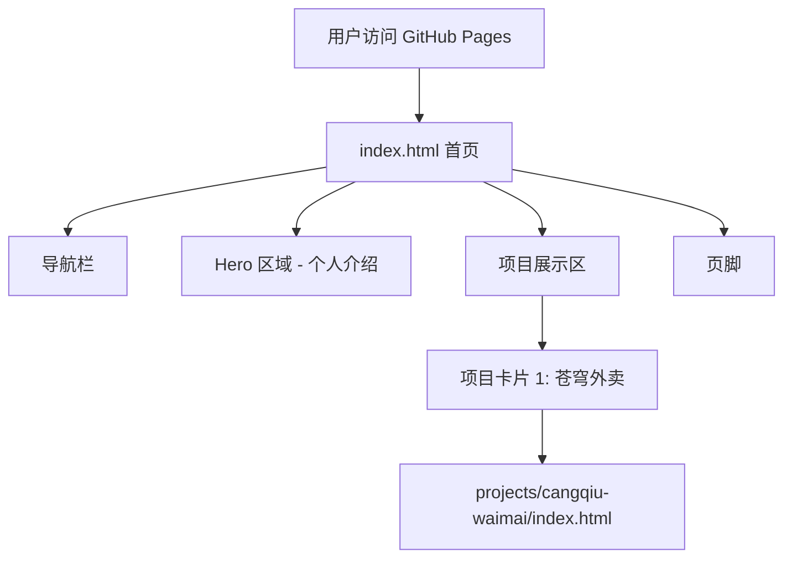

## 产品概述

开发一个个人作品集网站，用于展示开发者 ygccbpkn 的项目作品。网站采用现代简约风格（黑白/灰白配色），部署到 GitHub Pages。

## 核心功能

- 首页展示：包含个人介绍区域和项目展示区域
- 项目卡片展示：显示项目名称、描述、技术栈、截图
- 项目详情查看：点击项目可跳转到新页面查看项目详情或演示
- 响应式设计：支持桌面端和移动端浏览
- 苍穹外卖项目展示：展示全栈项目（Spring Boot + 微信小程序），提供项目介绍、技术栈、截图轮播、GitHub链接

## 项目信息

- 开发者昵称：ygccbpkn
- 展示项目：苍穹外卖（Spring Boot后端 + 微信小程序前端）
- 项目特点：微信小程序无法在浏览器直接运行，提供项目介绍和截图展示
- 部署目标：GitHub Pages（纯静态网站）

## 技术栈选择

- **前端框架**：纯 HTML5 + CSS3 + JavaScript（无框架依赖，轻量快速）
- **样式方案**：CSS Grid + Flexbox 布局，CSS 变量管理主题色
- **部署平台**：GitHub Pages（免费静态托管）
- **版本控制**：Git + GitHub

## 实现方案

### 项目结构

```
d:/桌面/个人作品集网站/
├── index.html              # 首页（主入口）
├── css/
│   └── style.css          # 主样式文件
├── js/
│   └── main.js            # 主逻辑文件
├── projects/
│   └── cangqiu-waimai/    # 苍穹外卖项目展示页
│       ├── index.html      # 项目详情页
│       ├── css/
│       ├── js/
│       └── images/        # 项目截图
├── images/                 # 网站通用图片
└── README.md              # 项目说明
```

### 核心实现策略

1. **单页应用式首页**：index.html 包含完整的首页内容，通过 CSS 实现平滑滚动
2. **项目数据配置化**：在 main.js 中定义项目数据对象，便于后续添加新项目
3. **苍穹外卖项目处理**：

- 创建独立的项目展示页（projects/cangqiu-waimai/index.html）
- 展示项目介绍、技术架构图、功能截图轮播
- 提供 GitHub 仓库链接（用户需自行上传代码到 GitHub）
- 说明微信小程序需在微信开发者工具中运行

### 性能优化

- 图片懒加载：项目截图使用 lazy loading
- CSS/JS 压缩：部署前压缩静态资源
- 字体优化：使用系统字体栈，避免外部字体加载

### 可扩展性设计

- 项目数据集中管理：新增项目只需在 main.js 中添加项目配置对象
- 模块化 CSS：按功能模块组织样式，便于维护
- 组件化思维：虽然不用框架，但采用组件化思维方式组织代码

## 架构设计

### 系统架构图



### 数据流

1. 用户访问 index.html
2. main.js 加载项目数据配置
3. 动态生成项目卡片 DOM 元素
4. 用户点击项目卡片 → 跳转到项目详情页（新标签页）
5. 项目详情页展示项目详细信息

## 目录结构详细说明

### 新增/修改文件列表

```
d:/桌面/个人作品集网站/
├── index.html                  # [NEW] 网站首页，包含导航栏、Hero区域、项目展示区、页脚
├── css/
│   └── style.css              # [NEW] 主样式文件，现代简约黑白灰配色，响应式设计
├── js/
│   └── main.js                # [NEW] 主逻辑文件，项目数据配置、动态渲染、交互逻辑
├── projects/
│   └── cangqiu-waimai/
│       ├── index.html         # [NEW] 苍穹外卖项目详情页
│       ├── css/
│       │   └── style.css     # [NEW] 项目详情页样式
│       ├── js/
│       │   └── main.js       # [NEW] 项目详情页逻辑（截图轮播等）
│       └── images/           # [NEW] 项目截图目录（用户需自行添加截图）
├── images/                    # [NEW] 网站通用图片（头像、logo等）
└── README.md                  # [NEW] 项目说明文档
```

## 关键代码结构

### 项目数据配置接口（main.js）

```javascript
// 项目数据类型定义
const Project = {
    id: String,           // 项目唯一标识
    name: String,         // 项目名称
    description: String,  // 项目描述
    techStack: Array,     // 技术栈数组
    screenshot: String,   // 封面截图路径
    detailUrl: String,    // 详情页URL
    githubUrl: String,    // GitHub仓库URL（可选）
    demoUrl: String       // 在线演示URL（可选）
};

// 项目数据配置
const projects = [
    {
        id: 'cangqiu-waimai',
        name: '苍穹外卖',
        description: '一个完整的外卖平台系统，包含微信小程序端和Spring Boot后端...',
        techStack: ['Spring Boot', 'MyBatis', 'MySQL', 'Redis', '微信小程序', 'UniApp'],
        screenshot: 'projects/cangqiu-waimai/images/cover.png',
        detailUrl: 'projects/cangqiu-waimai/index.html',
        githubUrl: '#',  // 用户需填写实际GitHub地址
        demoUrl: null
    }
];
```

## 设计风格

采用现代简约风格，以黑白/灰白为主色调。整体设计干净、专业，突出项目内容本身。

## 设计内容描述

### 页面规划（共1个页面：首页）

#### 首页（index.html）

**区块1：导航栏（顶部固定）**

- 左侧：网站 Logo/昵称 "ygccbpkn"
- 右侧：导航链接（首页、项目、关于）
- 样式：白色背景，底部细微阴影，固定顶部

**区块2：Hero 区域（个人介绍）**

- 居中布局，大号标题 "Hi, I'm ygccbpkn"
- 副标题：简短的自我介绍（如"全栈开发者 | Java & Vue"）
- 可选：个人头像（圆形，灰白边框）
- 样式：浅灰色背景（#f5f5f5），上下留白充足

**区块3：项目展示区**

- 标题："我的项目"
- 项目卡片网格布局（桌面端2列，移动端1列）
- 每张卡片包含：项目封面图、项目名称、简短描述、技术栈标签
- 卡片悬停效果：轻微上移 + 阴影加深
- 样式：白色卡片，圆角，细微边框

**区块4：页脚**

- 居中文字：Copyright © 2024 ygccbpkn
- 可选：GitHub/社交媒体链接图标
- 样式：深灰色背景（#1a1a1a），白色文字

### 响应式设计

- 桌面端（>1024px）：项目卡片2列布局
- 平板端（768-1024px）：项目卡片2列布局，适当缩小
- 移动端（<768px）：项目卡片1列布局，导航栏简化

### 动画效果

- 页面滚动时，项目卡片淡入动画
- 卡片悬停时，轻微上移（translateY(-4px)）和阴影变化
- 导航栏链接悬停时，底部边框动画

## 字体系统

- 字体族：系统字体栈（-apple-system, BlinkMacSystemFont, "Segoe UI", Roboto, "Helvetica Neue", Arial, sans-serif）
- 标题：32px, 粗体（600）
- 副标题：20px, 中等（500）
- 正文：16px, 常规（400）

## Agent Extensions

### SubAgent

- **code-explorer**
- Purpose: 探索苍穹外卖项目代码结构，了解技术栈和项目组织方式
- Expected outcome: 获取项目详细结构信息，用于编写准确的项目描述和技术栈说明